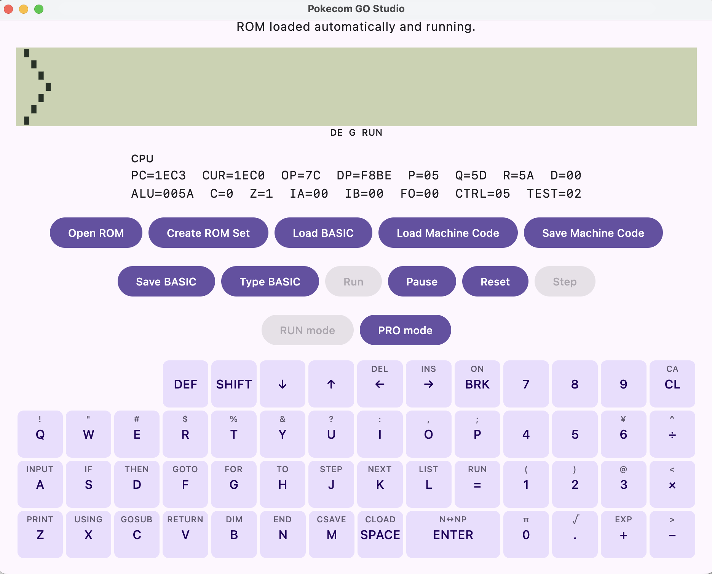

# Pokecom GO Studio Technical Preview 0.1

Git version: `v0.1.0-alpha.1`

Pokecom GO Studio Technical Preview 0.1 is the first preview of the desktop development environment
in the Pokecom GO Plus project. It is intended for early testing and feedback, not as a stable release.

## Highlights

- Kotlin Multiplatform Emulator Core shared across future desktop and mobile products
- SC61860 CPU execution with deterministic cycle accounting
- PC-1245 and PC-1250／1251／1255 family support
- Real ROM and `.pgrom` package loading
- RUN／PRO／RSV mode selection where supported by the machine
- Physical keyboard and machine-specific on-screen keyboard input
- LCD rendering and CPU state display
- Cycle-timed PCM sound output
- BASIC text import through both direct Tokenizer and ROM editor paths
- BASIC text export
- `.dmp` memory data import and export
- Hardware RAM and expanded RAM modes for the PC-1251 family

## Platform status

- macOS: ROM boot and the principal interactive features have been tested manually.
- Windows: ROM boot, keyboard input, and BASIC program operation have been tested manually with the x64
  package emulated by Windows ARM64 in VMware on an Apple Silicon Mac. Direct3D and OpenGL produced
  corrupted Material button hover rendering in that environment, so Software rendering is the conservative
  default until native Windows x64 is tested. `PGP_RENDER_API` remains available for backend comparison.
- Linux x86_64: the extracted archive, audio playback, and the DEB install, launch, and uninstall flow have
  been tested manually. ARM64 packages are not produced yet, and the DEB currently appears in the Other
  menu category.
- Android／iOS: Pokecom GO Player has not been implemented yet.

This preview provides source code and desktop packages built for macOS, Windows, and Linux.
The packages are not signed with a platform distribution identity, and the macOS package is not notarized.
Operating-system security warnings may therefore be shown.
Building from source requires JDK 21. See the repository `README.md` for the current commands.

## Preview

## ROM images

No ROM image is included in the repository or release. Users must provide a ROM image that they have
obtained lawfully from a supported machine. Do not attach ROM images to GitHub Issues.

## Known limitations

- Linux audio, the complete file-I/O set, and native file dialogs still require a final manual test pass.
- Linux ARM64 packages are not available yet.
- Windows Direct3D／OpenGL rendering must be tested on native Windows x64 and re-evaluated after relevant
  Compose／Skiko updates. The current Software default may use more CPU than a GPU backend.
- The ROM Importer guide and the UI for machines with banked ROMs are provisional.
- BASIC input through the ROM editor retains the physical machine's line-length limit. Use the direct
  Tokenizer path for long lines.
- Sound emulation is an initial implementation and some programs may produce gaps or waveforms that differ
  from the physical machine.
- On Windows, click noise can continue after a sounding BASIC program is stopped with BREAK, until the
  application exits. Audio-line lifetime and silent-buffer handling require further work.
- The `0xb000..0xbfff` mirror behavior of PC-1245／1250 requires further hardware or documentation checks.
- PC-1251 user-programmable reserved-word shortcuts are not emulated by the Studio UI.
- Save-state compatibility and stable public APIs are not guaranteed between Technical Preview releases.

## Feedback

After the repository becomes public, report reproducible defects and feature requests through GitHub Issues.
Include the host OS, selected machine, input format, and reproduction steps, but do not include ROMs,
credentials, personal information, or other non-redistributable data.

## Licensing and provenance

Pokecom GO Plus is released under the MIT License. Third-party notices are recorded in
`THIRD_PARTY_NOTICES.md`, and implementation provenance is recorded in `docs/PORTING_NOTES.md`.
